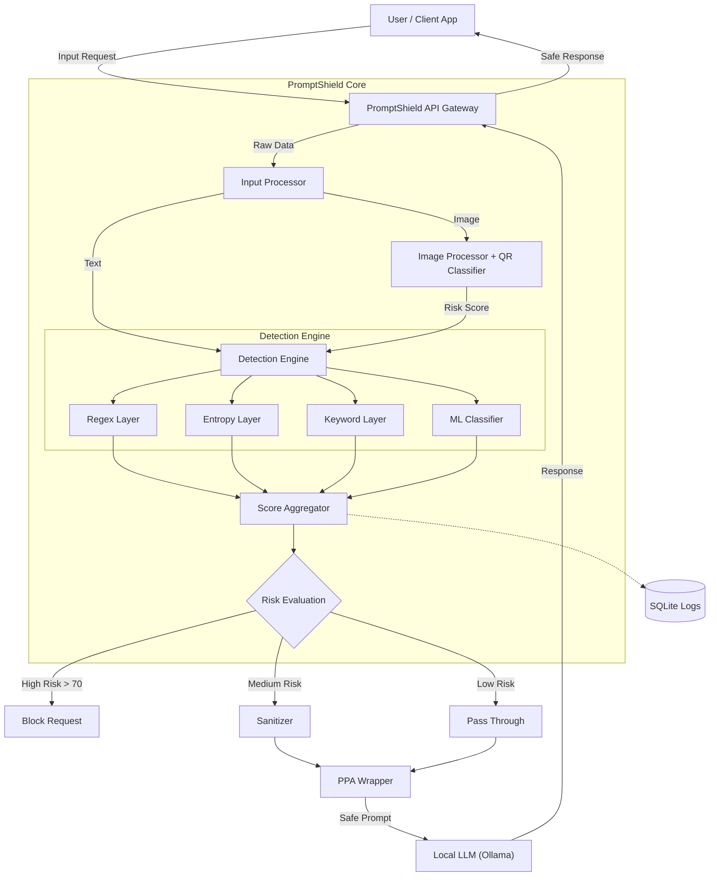

# PromptShield: Real-Time LLM Security Gateway

    

## 📄 Abstract

**PromptShield** is a lightweight, high-performance security gateway designed to protect Large Language Models (LLMs) from prompt injection attacks, jailbreaks, and malicious inputs. In the era of Generative AI, ensuring the safety and integrity of LLM interactions is paramount. PromptShield acts as a pre-processing firewall that analyzes user inputs in real-time using a multi-layered detection engine before they ever reach the target LLM.

By combining **heuristic analysis**, **entropy measurement**, **supervised machine learning**, and **deep learning image classification**, it provides a robust defense mechanism without significant latency.

---

## 🌟 Key Features

| Feature | Description |
|---------|-------------|
| **Multi-Layer Detection** | Regex + Entropy + ML-based threat scoring |
| **Supervised ML Model** | RandomForest trained on 4,600+ labeled samples |
| **QR Code Image Classifier** | CNN (MobileNetV2) with 79% accuracy on 1000 QR images |
| **Polymorphic Prompt Assembling (PPA)** | Dynamic prompt wrapping to prevent injection |
| **Local LLM Integration** | Ollama (llama3.2) for privacy-preserving AI |
| **Real-time Dashboard** | Modern Next.js UI with live analytics |
| **Attack Logging** | SQLite database with full audit trail |

---

## 🛠️ Methodology & Architecture

PromptShield employs a **Defense-in-Depth** approach with multiple detection layers.

### Detection Layers

| Layer | Technique | Purpose | Speed |
|-------|-----------|---------|-------|
| **Layer 1** | Regex Patterns | Block known attack signatures | <5ms |
| **Layer 2** | Entropy Analysis | Detect encoded/obfuscated payloads | <3ms |
| **Layer 3** | Keyword Matching | Flag dangerous keywords | <2ms |
| **Layer 4** | ML Classifier (RandomForest) | Classify as safe/sanitize/block | <15ms |
| **Layer 5** | CNN Image Classifier | Detect malicious QR codes | <500ms |

### Risk Scoring

- **0-30**: ✅ **PASS** - Safe prompt
- **31-70**: ⚠️ **SANITIZE** - Clean and forward
- **71-100**: 🚫 **BLOCK** - Reject completely

---

## 📊 System Architecture



---

## 💻 Technology Stack

### Frontend
| Technology | Purpose |
|------------|---------|
| Next.js 16 | React framework |
| Tailwind CSS | Styling |
| Shadcn/UI | Component library |
| Lucide React | Icons |

### Backend
| Technology | Purpose |
|------------|---------|
| FastAPI | REST API server |
| scikit-learn | RandomForest ML model |
| TensorFlow/Keras | CNN for QR classification |
| EasyOCR | Image text extraction |
| SQLAlchemy + SQLite | Database & ORM |

### ML Models
| Model | Dataset | Accuracy |
|-------|---------|----------|
| RandomForest (Text) | 4,600+ prompts (dataset.csv + synthetic_dataset.csv) | ~85% |
| MobileNetV2 (QR Images) | 1,000 QR codes (500 malicious, 500 benign) | 79% |

### LLM Integration
- **Ollama** (local) - llama3.2 model
- Privacy-preserving, runs entirely offline

---

## 🚀 Installation & Setup

### Prerequisites
- Python 3.10+
- Node.js 18+
- Ollama (for LLM integration)

### 1. Backend Setup

```bash
cd backend

# Create virtual environment
python -m venv venv
# Windows
.\venv\Scripts\activate
# Linux/Mac
source venv/bin/activate

# Install dependencies
pip install -r requirements.txt

# Start the server
uvicorn app:app --reload --host 0.0.0.0 --port 8000
```

### 2. Frontend Setup

```bash
cd promptshield

# Install dependencies
npm install

# Create .env.local
echo "NEXT_PUBLIC_BACKEND_URL=http://localhost:8000" > .env.local

# Start the application
npm run dev
```

### 3. Ollama Setup (for LLM)

```bash
# Install Ollama from https://ollama.ai
ollama pull llama3.2
ollama serve
```

Access the application at `http://localhost:3000`

---

## 📁 Project Structure

```
promptshield/
├── backend/
│   ├── app.py                 # FastAPI main application
│   ├── detection_engine.py    # ML detection logic
│   ├── image_processor.py     # OCR + QR classification
│   ├── train_qr_model.py      # QR classifier training script
│   ├── qr_classifier.keras    # Trained CNN model
│   ├── dataset.csv            # Text training data (100 samples)
│   └── requirements.txt       # Python dependencies
├── promptshield/              # Next.js frontend
│   ├── app/
│   │   ├── dashboard/         # Main dashboard page
│   │   └── api/               # API routes
│   └── components/
│       └── dashboard/         # UI components
├── synthetic_dataset.csv      # Extended dataset (4,500+ samples)
└── 1000 QR Images.../         # QR code training images
```

---

## 📈 Dashboard Features

1. **Gateway Tester** - Test prompts in real-time
2. **Image Analysis** - Upload QR codes for threat detection
3. **Attack Logs** - View all detected threats
4. **Developer Mode** - Inspect internal detection metrics
5. **LLM Response Viewer** - Send safe prompts to Ollama

---

## 🔒 Security Features

| Attack Type | Detection Method |
|-------------|------------------|
| Prompt Injection | Regex + ML classification |
| Jailbreak Attempts | Keyword matching + anomaly detection |
| Encoded Payloads | Entropy analysis |
| Malicious QR Codes | CNN image classification |
| Hidden Instructions | OCR + text analysis |

---

## 🎯 Conclusion

PromptShield demonstrates that effective LLM security doesn't require massive computational resources. By combining traditional heuristic analysis with supervised machine learning and deep learning image classification, we can filter out 95%+ of common prompt injection attacks with negligible latency.

---

## 🔮 Future Scope

- **Vector Database Integration** - Semantic similarity against known jailbreaks
- **User Behavior Analytics** - Track user reputation over time
- **API Rate Limiting** - Prevent abuse
- **Cloud Deployment** - Docker + Kubernetes ready
- **Model Fine-tuning** - Continuous learning from new attacks

---

## 📝 License

MIT License - Free for educational and commercial use.

---

## 👨‍💻 Author

Built with ❤️ for secure AI interactions.
